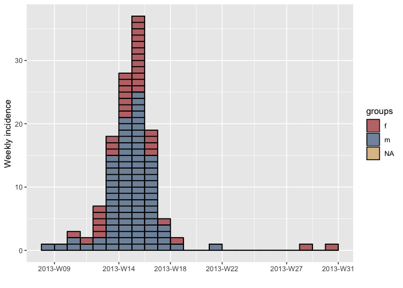

Epidemiological description
================

This is a living document to gather functions and code snippets that
eventually will evolve into an outbreak report template (+ package(s)).

``` r
# as a starting point
main_dataset <- outbreaks::fluH7N9_china_2013
```

### Data preparation

``` r
main_dataset <- main_dataset %>% 
  mutate(age = as.integer(age)) %>% 
  mutate(age_group = cut(age, breaks = c(0, 5, 10, 30, 50, 80), right = FALSE))
```

### Person

  - \[Who is affected: how many in total; male or female; young, adult
    or old? What are the links between affected people – work place,
    school, social gathering? Is there a high rate of illness in
    contacts? Is there a high rate of illness in health workers? You may
    want to include: a bar chart showing case numbers or incidence by
    age group and sex; attack rates (AR); and numbers of deaths (in
    suspected and confirmed cases), mortality rates and/or case fatality
    ratio (CFR)\]

#### By age group and sex

Cases by sex

``` r
main_dataset %>% 
  group_by(gender) %>% 
  summarise(cases = n()) %>% 
  kable()
```

| gender | cases |
| :----- | ----: |
| f      |    39 |
| m      |    95 |
| NA     |     2 |

Cases by age group

``` r
main_dataset %>% 
  group_by(age_group) %>% 
  summarise(cases = n()) %>% 
  kable()
```

| age\_group | cases |
| :--------- | ----: |
| \[0,5)     |     5 |
| \[5,10)    |     8 |
| \[10,30)   |    46 |
| \[30,50)   |    56 |
| \[50,80)   |    21 |

#### Case Fatality Rate

The CFR is a proportion

``` r
proportion <- function (x, n, conf_level = 0.95, multiplier = 1) {
  res <- binom::binom.wilson(x, n, conf.level = conf_level)
  res <- res[, c("x", "n", "mean", "lower", "upper")]
  colnames(res) <- c("x", "n", "prop", "lower", "upper")
  res$prop <- res$prop * multiplier
  res$lower <- res$lower * multiplier
  res$upper <- res$upper * multiplier
  res
}

case_fatality_rate <- function (deaths, population, conf_level = 0.95) {
  res <- proportion(deaths, population, conf_level = conf_level)
  colnames(res) <- c("deaths", "population", "cfr", "lower", "upper")
  res
}

known_status <- main_dataset[!is.na(main_dataset$outcome), ]
deaths <- sum(known_status$outcome == "Death")
population <- length(main_dataset$outcome)


case_fatality_rate(deaths, population) %>% knitr::kable()
```

| deaths | population |       cfr |     lower |     upper |
| -----: | ---------: | --------: | --------: | --------: |
|     32 |        136 | 0.2352941 | 0.1718861 | 0.3132451 |

CFR by age group

``` r
group_by(known_status, age_group) %>%
  do({
    deaths <- sum(.$outcome == "Death")
    population <- length(.$outcome)
    case_fatality_rate(deaths, population)
  }) %>%
  arrange(desc(lower)) %>%
  knitr::kable()
```

| age\_group | deaths | population |       cfr |     lower |     upper |
| :--------- | -----: | ---------: | --------: | --------: | --------: |
| \[50,80)   |      7 |         12 | 0.5833333 | 0.3195113 | 0.8067397 |
| \[30,50)   |     14 |         29 | 0.4827586 | 0.3138609 | 0.6556898 |
| \[10,30)   |      8 |         27 | 0.2962963 | 0.1585304 | 0.4848068 |
| \[5,10)    |      2 |          6 | 0.3333333 | 0.0967714 | 0.7000067 |
| \[0,5)     |      1 |          5 | 0.2000000 | 0.0362241 | 0.6244654 |

#### Attack rates

…

#### Mortality

``` r
mortality_rate <- function (deaths, population, 
                            conf_level = 0.95, multiplier = 10^4) {
  stopifnot(is.numeric(multiplier), length(multiplier) == 1L, multiplier > 0)
  # as in here https://www.cdc.gov/ophss/csels/dsepd/ss1978/lesson3/section3.html
  deaths / population * multiplier
  res <- proportion(deaths, population, conf_level = conf_level, multiplier = multiplier)
  est_label <- paste0("mortality per ", scales::number(multiplier))
  colnames(res) <- c("deaths", "population", est_label, "lower", "upper")
  res
}
```

Mortality rate per 100,000:

``` r
mortality_rate(deaths, population, multiplier = 10^4)
```

    ##   deaths population mortality per 10 000    lower    upper
    ## 1     32        136             2352.941 1718.861 3132.451

#### Single variable analysis

``` r
# Inspired by Daniel Gardiner
# https://github.com/DanielGardiner/UsefulFunctions/blob/efffde624d424d977651ed1a9ee4430cbf2b0d6f/single.variable.analysis.v0.3.R#L12
# just a quick prototype for RR

outcome <- main_dataset$outcome == "Death"
is_male <- main_dataset$gender == "m"
is_child <- as.integer(main_dataset$age) <= 12

univariate_analysis <- function (outcome, ...) {
  n <- length(outcome)
  predictors <- list(...)
  predictor_labels <- substitute(list(...))
  predictor_labels <- vapply(predictor_labels[-1L], deparse, character(1L))
  stopifnot(length(predictors) > 0L, 
            all(vapply(predictors, length, integer(1L)) == n),
            all(vapply(predictors, is.logical, logical(1L))))
  na_rows <- Reduce(function (acc, el) acc | is.na(el), predictors, init = FALSE)
  n_na_rows <- sum(na_rows)
  
  if (n_na_rows) {
    warning("Removed ", n_na_rows, " rows due to missing values")
  }
  
  res <- lapply(predictors, function (predictor) {
    table <- epitools::epitable(outcome[!na_rows], 
                                predictor[!na_rows])    
    #odds <- epitools::oddsratio(table, method = "wald") # what method?
    rr <- epitools::riskratio(table, method = "wald")
    midp_pval_rr <- rr$p.value[2L, 1L]
 
    cbind(
      data.frame(
        exp = rr$data[3L, 2L],
        exp_cases = rr$data[2L, 2L],
        exp_AR = round(rr$data[2L, 2L] / rr$data[3L, 2L], 1L),
        unexp = rr$data[1L, 3L],
        unexp_cases = rr$data[1L, 2L],
        unexp_AR = round(rr$data[1L, 2L] / rr$data[1L, 3L], 1L)
      ),
      t(rr$measure[2L, ]),
      data.frame(p_value = midp_pval_rr)
    )
  })
  
  cbind(
    data.frame(exposure = predictor_labels),
    do.call(rbind, res)
  )
}


res <- univariate_analysis(outcome, is_male, is_child)
```

    ## Warning in univariate_analysis(outcome, is_male, is_child): Removed 2 rows
    ## due to missing values

``` r
knitr::kable(res)
```

| exposure  | exp | exp\_cases | exp\_AR | unexp | unexp\_cases | unexp\_AR |  estimate |     lower |    upper |  p\_value |
| :-------- | --: | ---------: | ------: | ----: | -----------: | --------: | --------: | --------: | -------: | --------: |
| is\_male  |  56 |         22 |     0.4 |    46 |           34 |       0.7 | 0.9601518 | 0.7233926 | 1.274400 | 0.7785528 |
| is\_child |  14 |          3 |     0.2 |    46 |           11 |       0.2 | 0.4046921 | 0.1227969 | 1.333712 | 0.1225535 |

## CI Helper

Just a prototype for the idea

``` r
str_rate <- function(o, n, conf_level = 0.95, method = "wilson") {
  stopifnot(length(method) == 1L, is.character(method))
  stopifnot(length(conf_level) == 1L, is.numeric(conf_level))
  stopifnot(length(o) == 1L, is.numeric(o), 0 <= o)
  stopifnot(length(n) == 1L, is.numeric(n), o <= n)
  res <- binom::binom.confint(
    o, n,
    conf.level = conf_level,
    methods = method
  )
  # 71.30%; 95% CI 65.03-77.57%
  percent <- scales::percent_format(accuracy = 0.01)
  percent_wo_suffix <- scales::percent_format(accuracy = 0.01, suffix = "")
  paste0(
    percent(res$mean),
    "; ", scales::percent(conf_level, accuracy = 1),
    " CI ", percent_wo_suffix(res$lower), " ",  percent(res$upper)
  )
}
res <- str_rate(1, 5)
```

The case fatality rate is low (20.00%; 95% CI 3.62 62.45%).

### Time

  - \[When did the cases fall ill? Are numbers increasing or stable? You
    may want to include an Epi curve (bar chart showing number of new
    (suspected and confirmed) cases each day/week) \]

<!-- end list -->

``` r
library(incidence)
inc_week_7 <- incidence(main_dataset$date_of_onset, interval = 7)
```

    ## 10 missing observations were removed.

``` r
plot(inc_week_7)
```

<!-- -->

``` r
inc_week_7 <- incidence(main_dataset$date_of_onset, 
                        interval = 7, 
                        groups = main_dataset$gender)
```

    ## 10 missing observations were removed.

``` r
plot(inc_week_7, show_cases = TRUE, border = "black")
```

<!-- -->

### Place

  - \[Across what area: one or several villages, all from same school,
    etc. You may want to include a map of the distribution of cases;
    attack rates by location\]

#### Base maps using open streetmap

This is just an example to create an example base map based on open
street map for Western Area Urban, Sierra Leone. We pull in all primary
and secondary streets + houses. WIP

``` r
library(osmplotr)

# A bounding box of Western Area Urban
bbox <- osmdata::getbb("Western Area Urban")

# get highways by type
dat_highway_prim <- extract_osm_objects(key = "highway", value = "primary", bbox = bbox)
Sys.sleep(3) # be nice to overpass API
dat_highway_sec <- extract_osm_objects(key = "highway", value = "secondary", bbox = bbox)
Sys.sleep(3) # be nice to overpass API
dat_highway_tert <- extract_osm_objects(key = "highway", value = "tertiary", bbox = bbox)
Sys.sleep(3) # be nice to overpass API
dat_highway_res <- extract_osm_objects(key = "highway", value = "residential", bbox = bbox)
    
# now create the map
# more important roads are darker
map <- osm_basemap(bbox = bbox, bg = "white")
map <- add_osm_objects(map, dat_highway_res, col = "gray90")
map <- add_osm_objects(map, dat_highway_tert, col = "gray80")
map <- add_osm_objects(map, dat_highway_sec, col = "gray60")
map <- add_osm_objects(map, dat_highway_prim, col = "gray40")

map
```

<!-- -->
